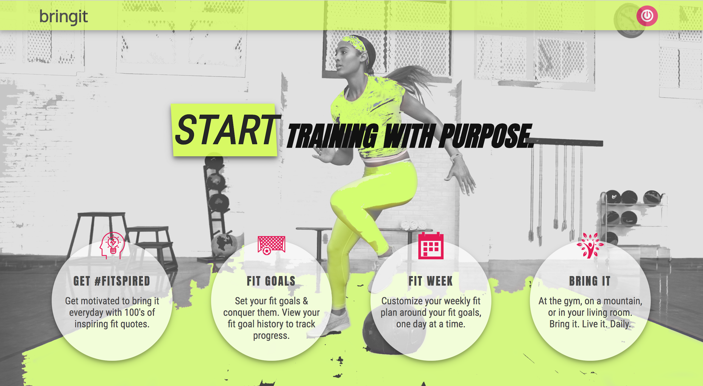
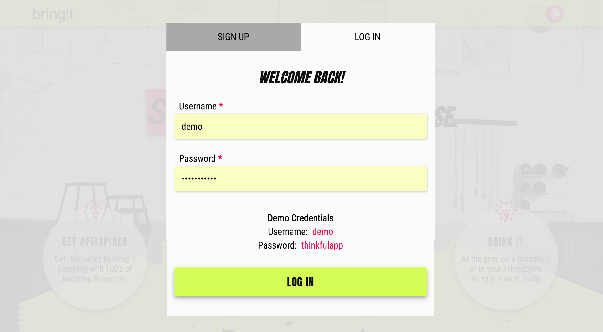
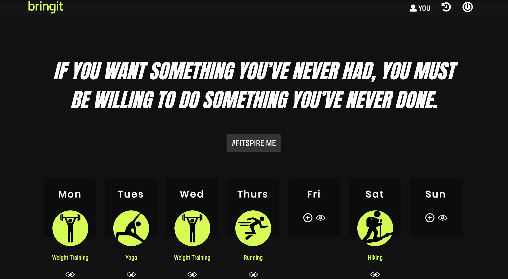
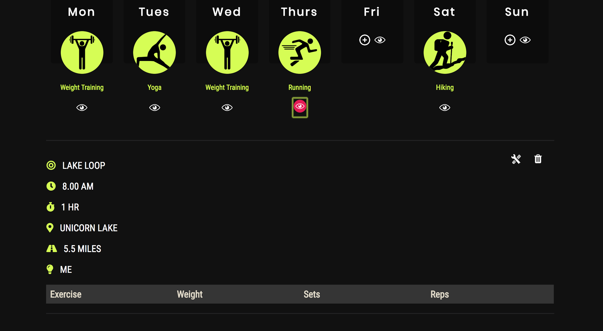
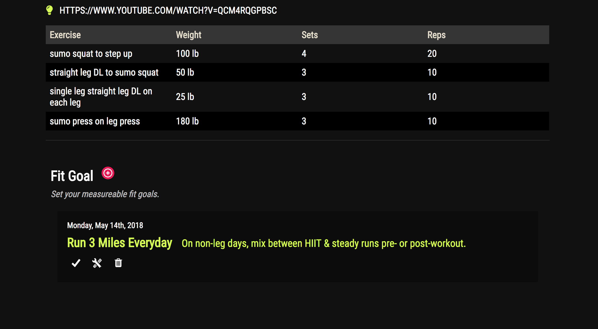
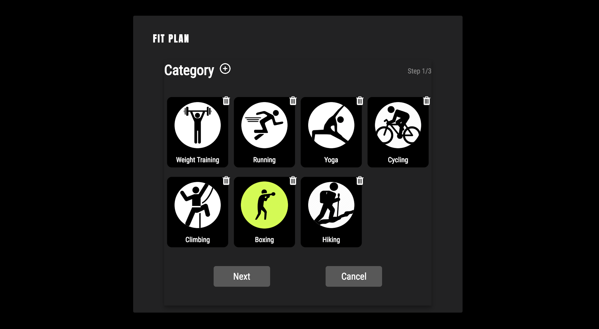
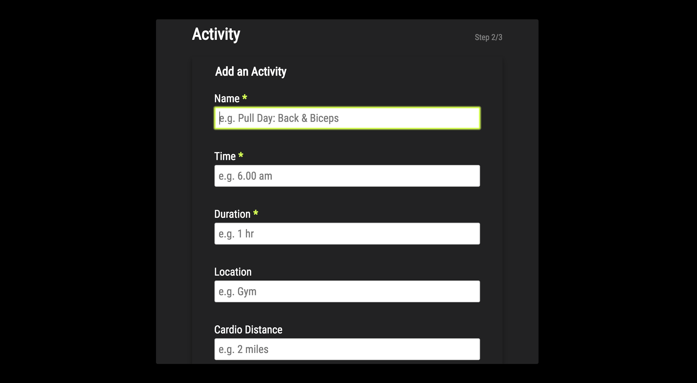
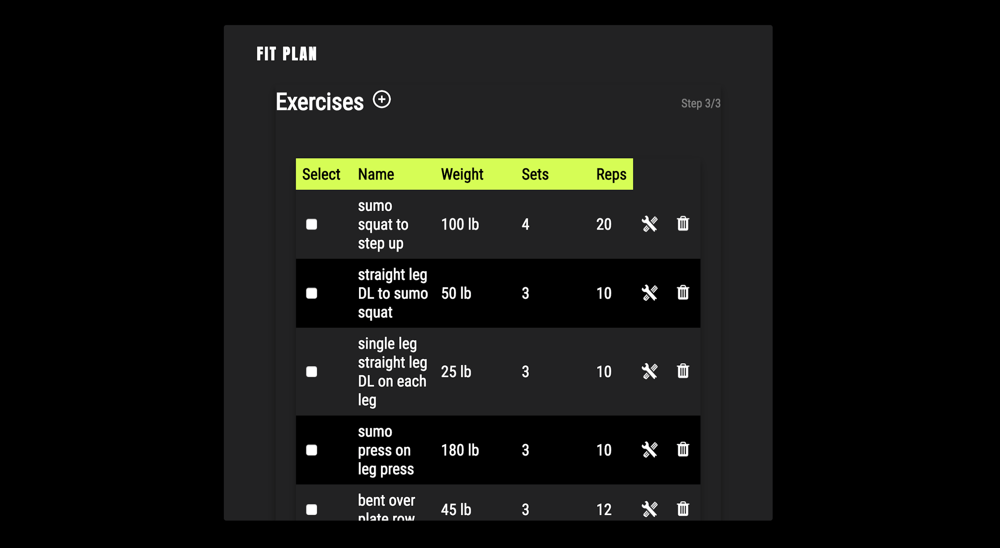

# bringit

[bringit](https://blooming-brushlands-53874.herokuapp.com/index.html) is a full-stack web application that  

## Features
* 
* 
* 
* Mobile responsive design

## Demo

- [Live Demo](https://blooming-brushlands-53874.herokuapp.com/index.html)

## Screenshots

#### Landing Page

#### Homepage

#### Day Plan Form

## Technologies

####Front End

* HTML5
* CSS3
* JavaScript
* jQuery

####Back End

* Node.js
* Express.js
* MongoDB
* Mongoose
* MVC framework
* Passport
* Bcrypt
* JWT

## Acknowledgements

* Jon Oyanguren

## Contributor

* Ola Assem
